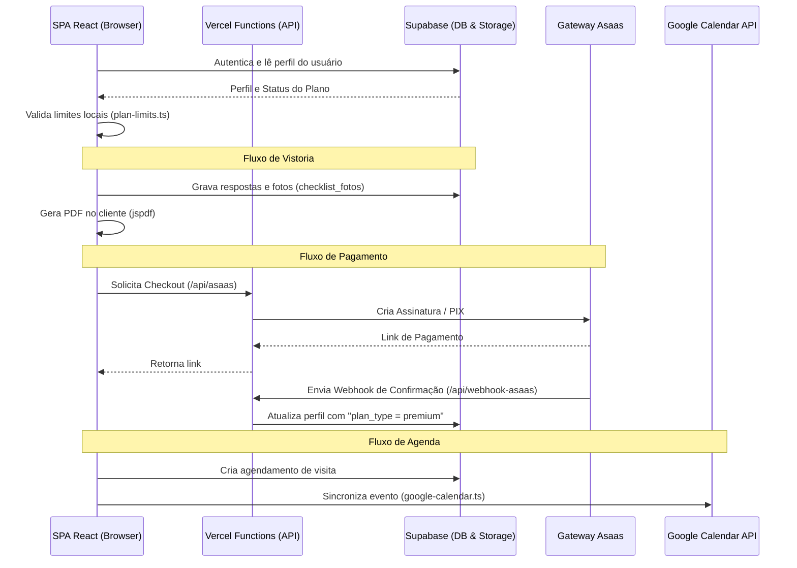

# Arquitetura e Stack do Sistema

Este documento descreve a estrutura de arquivos do projeto **RT Expert**, as ferramentas utilizadas e como as partes do sistema (frontend React, banco de dados Supabase e APIs do Vercel Serverless) se comunicam.

---

## 🛠️ Stack Tecnológica

O ecossistema é formado por três pilares principais:

### 1. Frontend (React Single Page Application)
* **Framework:** React + Vite + TypeScript (Typecheck feito via `npx tsc --noEmit`).
* **Estilização:** Tailwind CSS + UI components fornecidos pelo shadcn/ui.
* **Gerenciamento de Rotas:** React Router DOM (com suporte a parâmetros de busca/URL).
* **Consumo de APIs / Supabase Client:** `@supabase/supabase-js`.
* **Geração de PDF:** `jspdf`.
* **Outras Bibliotecas Principais:**
  * `lucide-react`: Ícones vetoriais.
  * `sonner`: Mensagens de notificação e alertas rápidos (toasts).
  * `date-fns`: Manipulação e formatação de datas.
  * `leaflet` e `react-leaflet`: Visualização do Mapa de Clientes.
  * `react-signature-canvas`: Painel tátil para coleta de assinaturas digitais.
  * `react-select`: Campo de seleção com busca dinâmica.

### 2. Backend (Supabase - ismemgtitjpvedgxmayo)
* **Autenticação:** Supabase Auth (E-mail/Senha e Google OAuth).
* **Banco de Dados:** PostgreSQL hospedado com RLS (Row Level Security) aplicado.
* **Storage:** Bucket privado `checklist_fotos` e buckets públicos para logos (`logos`) e avatares (`avatars`).
* **Edge Functions:** Funções Deno implantadas na infraestrutura do Supabase (`delete-account`, `cleanup-orphan-photos`).

### 3. Serverless Backend (Vercel Functions)
As funções hospedadas na pasta `api/` da Vercel atendem demandas que exigem segredos de API ou que necessitam de processamento fora do client (integração Asaas e autenticação com o Google):
* `api/asaas.js`: Criação de cobranças e assinaturas.
* `api/webhook-asaas.js`: Recebimento de callbacks de pagamento do Asaas para liberar/bloquear acesso no Supabase.
* `api/google-auth.js`: Geração do token OAuth inicial para sincronização com o Google Calendar.
* `api/google-refresh.js`: Renovação do token expirado do Google Calendar.

---

## 📂 Estrutura de Diretórios e Arquivos

O projeto está organizado da seguinte forma:

```text
├── api/                        # Rotas Serverless (Vercel)
│   ├── asaas.js                # Checkout de planos via Asaas
│   ├── google-auth.js          # Fluxo de OAuth do Google Calendar
│   ├── google-refresh.js       # Refresh token do Google Calendar
│   └── webhook-asaas.js        # Webhook de retorno do Asaas
├── docs/                       # Documentação técnica e operacional
│   ├── README.md               # Índice da documentação
│   ├── architecture.md         # Detalhes desta arquitetura
│   ├── database.md             # Banco de dados e Storage
│   ├── features.md             # Funcionalidades e regras de negócio
│   ├── plans_and_limits.md     # Sistema de planos e limites
│   ├── api_and_integrations.md # Integrações com terceiros (Asaas, Google Calendar)
│   └── guidelines_and_rules.md # Diretrizes de código para desenvolvedores
├── src/                        # Código Fonte do SPA
│   ├── main.tsx                # Inicializador React
│   ├── App.tsx                 # Definições de rotas e providers
│   ├── index.css               # Estilos globais e Tailwind
│   ├── components/             # Componentes reusáveis
│   │   ├── ui/                 # Componentes básicos do shadcn/ui
│   │   ├── ConfirmDialog.tsx   # Modal de confirmação segura
│   │   ├── Layout.tsx          # Menu lateral de navegação e cabeçalhos
│   │   ├── SignatureCanvas.tsx # Canvas para assinar vistoria
│   │   ├── SignedPhoto.tsx     # Wrapper para exibir imagem privada do bucket
│   │   └── select-styles.ts    # Customização visual do react-select
│   ├── hooks/                  # Hooks customizados do React
│   ├── integrations/           # Integração automática com Supabase
│   │   └── supabase/
│   │       ├── client.ts       # Inicialização da conexão
│   │       └── types.ts        # Tipagens do banco geradas pelo CLI
│   ├── lib/                    # Funções utilitárias e lógica de negócios
│   │   ├── google-calendar.ts  # Script de sincronização de agendamentos
│   │   ├── image-utils.ts      # Compressão e tratamento de fotos
│   │   ├── pdf-generator.ts    # Engine de geração de relatórios de vistoria
│   │   ├── photo-utils.ts      # Resolução de URLs assinadas
│   │   ├── plan-limits.ts      # Controle de limites (SaaS)
│   │   ├── text-utils.ts       # Sanitização e normalização de strings
│   │   └── utils.ts            # Auxiliar do Tailwind
│   └── pages/                  # Views / Telas do aplicativo
│       ├── Dashboard.tsx       # Estatísticas e compromissos do dia
│       ├── Visitas.tsx         # Agenda (criação e controle de visitas)
│       ├── Clientes.tsx        # CRM de empresas e status no mapa
│       ├── MapaClientes.tsx    # Visualização de rotas com Leaflet
│       ├── ChecklistDesigner.ts# Criador de modelos de checklists
│       ├── AplicarChecklist.tsx# Formulário de vistoria e coleta de fotos
│       ├── ChecklistsProntos.ts# Visitas Feitas (Histórico, download de PDFs)
│       ├── Upgrade.tsx         # Tela de assinatura de planos
│       ├── Settings.tsx        # Configuração da empresa, RT e backup de dados
│       ├── Auth.tsx            # Login, Cadastro e Recuperação de senha
│       ├── PoliticaPrivacidade.ts
│       ├── TermosDeUso.tsx
│       └── NotFound.tsx
├── supabase/                   # Configurações do Supabase local
│   ├── config.toml
│   ├── functions/              # Edge Functions
│   │   ├── delete-account/     # Exclusão definitiva de conta (LGPD)
│   │   ├── cleanup-orphan-photos/# Rotina de remoção de imagens órfãs
│   │   └── google-auth/
│   └── migrations/             # Histórico de alterações do banco SQL
└── package.json                # Gerenciamento de pacotes Node.js
```

---

## ⚡ Fluxo de Execução das Requisições


